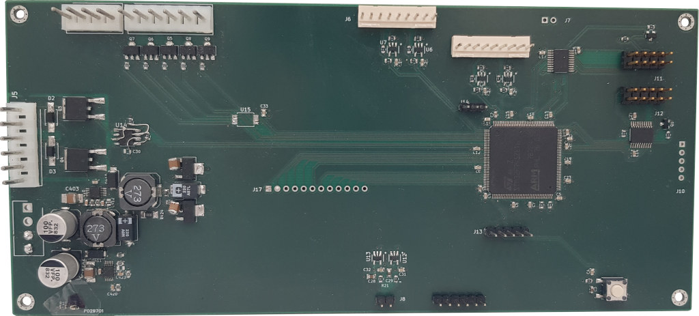
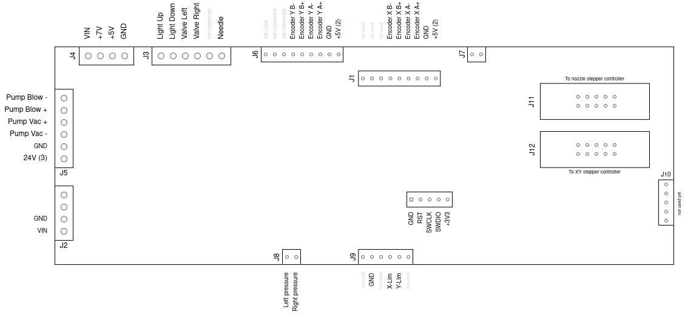

# pcb

Pinout
------

Diagram and table below show the details of boards connectors.

<table>
<tr><th>Connector</th><th>Signal</th><th>Type</th><th>MCU io</th>     <th>&nbsp</th> <th>Connector</th><th>Signal</th><th>Type</th><th>MCU io</th></tr>
<tr><td>J3-1</td><td>Light UP</td><td>NPN Output</td><td>PD10</td>    <td>&nbsp</td> <td>J8-1</td><td>Left nozzle pressure</td><td>Analog IN</td><td>PC5</td></tr>
<tr><td>J3-2</td><td>Light Down</td><td>NPN Output</td><td>PD9</td>   <td>&nbsp</td> <td>J8-2</td><td>Right nozzle pressure</td><td>Analog IN</td><td>PC4</td></tr>
<tr><td>J3-3</td><td>Valve Left</td><td>NPN Output</td><td>PD8</td>   <td>&nbsp</td> <td>J9-4</td><td>X-axis zero switch</td><td>Dry Contact</td><td>PC10</td></tr>
<tr><td>J3-4</td><td>Valve Right</td><td>NPN Output</td><td>PB15</td> <td>&nbsp</td> <td>J9-5</td><td>Y-axis zero switch</td><td>Dry Contact</td><td>PC11</td></tr>
<tr><td>J3-6</td><td>Needle</td><td>NPN Output</td><td>PB14</td>      <td>&nbsp</td> <td>&nbsp</td><td>&nbsp</td><td>&nbsp</td><td>&nbsp</td></tr>
<tr><td>J5-1</td><td>Pump Blow</td><td>NPN Output</td><td>PD12</td>   <td>&nbsp</td> <td>&nbsp</td><td>&nbsp</td><td>&nbsp</td><td>&nbsp</td></tr>
<tr><td>J5-4</td><td>Pump Vaccum</td><td>NPN Output</td><td>PD13</td> <td>&nbsp</td> <td>&nbsp</td><td>&nbsp</td><td>&nbsp</td><td>&nbsp</td></tr>
<tr><td>J6-4</td><td>Y encoder B-</td><td>Digital IN</td><td>PB13</td><td>&nbsp</td> <td>J1-4</td><td>X encoder B-</td><td>Digital IN</td><td>PE15</td></tr>
<tr><td>J6-5</td><td>Y encoder B+</td><td>Digital IN</td><td>PB13</td><td>&nbsp</td> <td>J1-5</td><td>X encoder B+</td><td>Digital IN</td><td>PE15</td></tr>
<tr><td>J6-6</td><td>Y encoder A-</td><td>Digital IN</td><td>PB12</td><td>&nbsp</td> <td>J1-6</td><td>X encoder A-</td><td>Digital IN</td><td>PE14</td></tr>
<tr><td>J6-7</td><td>Y encoder A+</td><td>Digital IN</td><td>PB12</td><td>&nbsp</td> <td>J1-7</td><td>X encoder A+</td><td>Digital IN</td><td>PE14</td></tr>
<tr><td>J12-1</td><td>Reels Step clock</td><td>Digital Output</td><td>PA2</td> <td>&nbsp</td> <td>J11-1</td><td>Nozzle 2 rotation clock</td><td>Digital Output</td><td>PB0</td>
<tr><td>J12-2</td><td>Reels Direction</td><td>Digital Output</td><td>PC2</td>  <td>&nbsp</td> <td>J11-2</td><td>Nozzle 2 rotation direction</td><td>Digital Output</td><td>PF14</td>
<tr><td>J12-3</td><td>Y step clock</td><td>Digital Output</td><td>PA1</td>     <td>&nbsp</td> <td>J11-3</td><td>Nozzle 1 rotation clock</td><td>Digital Output</td><td>PA7</td>
<tr><td>J12-4</td><td>Y Direction</td><td>Digital Output</td><td>PC1</td>      <td>&nbsp</td> <td>J11-4</td><td>Nozzle 1 rotation direction</td><td>Digital Output</td><td>PF15</td>
<tr><td>J12-5</td><td>X Step clock</td><td>Digital Output</td><td>PA0</td>     <td>&nbsp</td> <td>J11-5</td><td>Nozzle Z clock</td><td>Digital Output</td><td>PA6</td></tr>
<tr><td>J12-6</td><td>X Direction</td><td>Digital Output</td><td>PC0</td>      <td>&nbsp</td> <td>J11-6</td><td>Nozzle Z direction</td><td>Digital Output</td><td>PF13</td></tr>
<tr><td>J12-7</td><td>XYR enable</td><td>Digital Output</td><td>PA4</td>       <td>&nbsp</td> <td>J11-7</td><td>BCD enable</td><td>Digital Output</td><td>PA5</td></tr>
</table>

Changelog
---------

 * rev 0.2
   - Support for pumps control (vaccum and blow)
   - Support for logic outputs (valves, needle, lights)
   - Analog inputs for pressure sensors

 * rev 0.1
   - Support all stepper motors (X, Y, Z, reel, nozzle)
   - Inputs for encoders (X and Y axis)
   - Power supplies for head (7v, 5v)
